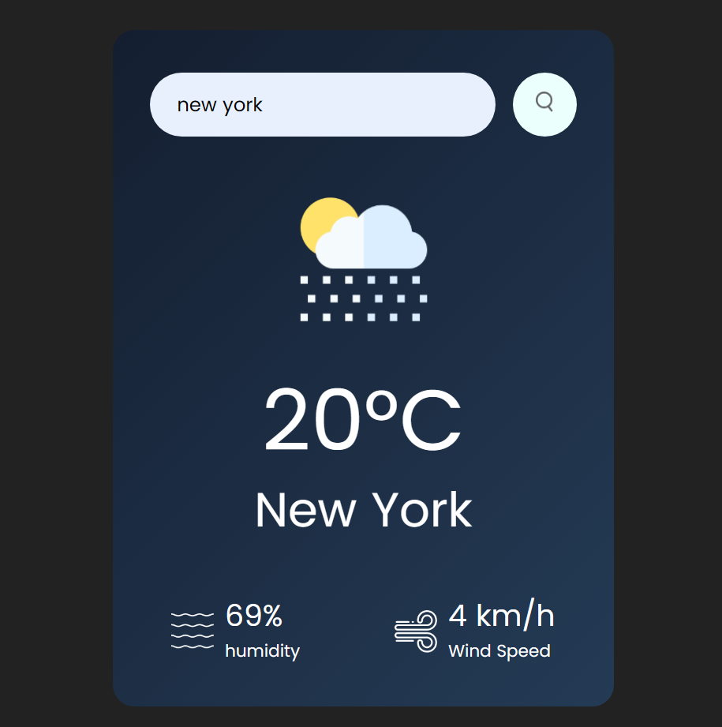

# 🌤️ Weather App

A clean and responsive **Weather App** built using **HTML**, **CSS**, and **JavaScript**. This app fetches real-time weather data using the **OpenWeatherMap API** and displays current temperature, weather conditions, and more.

---

## 📸 Preview

  

---

## 🔍 Features

- Real-time weather data for any city
- Temperature, humidity, wind speed, and weather condition icons
- Responsive UI design
- Error handling for invalid inputs
- Minimal, beginner-friendly codebase

---

## 🧰 Technologies Used

- **HTML5**
- **CSS3**
- **JavaScript (Vanilla)**
- **[OpenWeatherMap API](https://openweathermap.org/api)**

---
